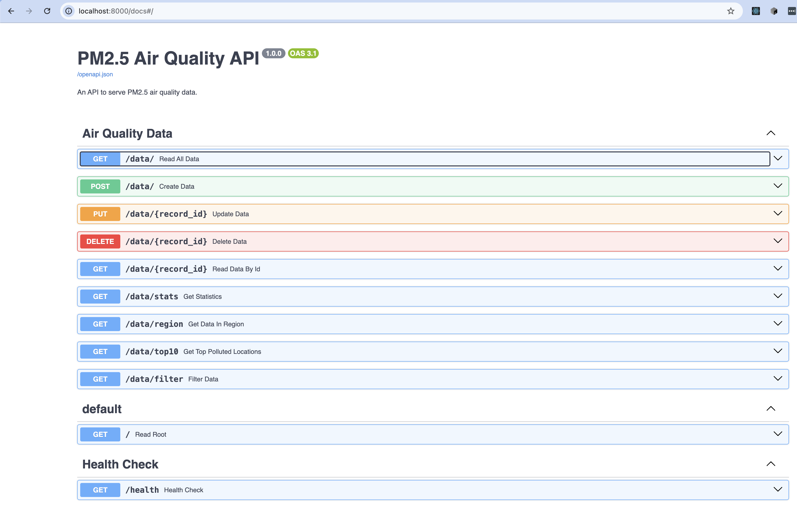
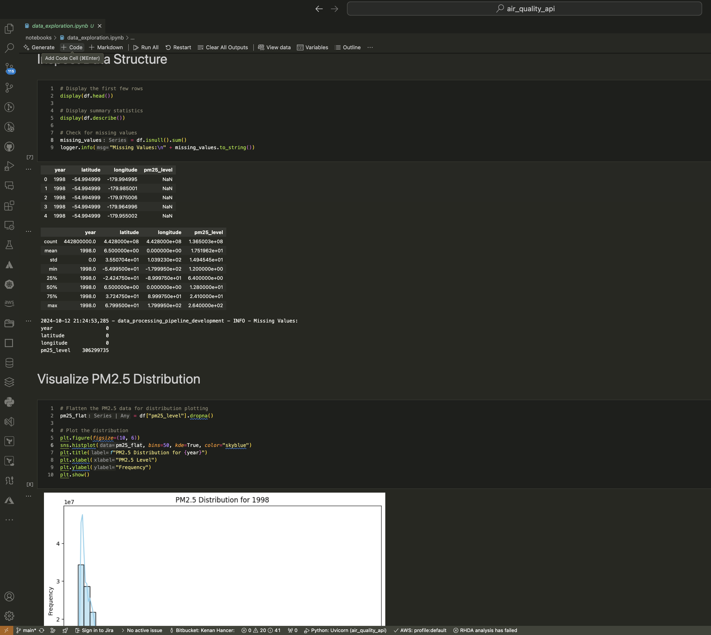
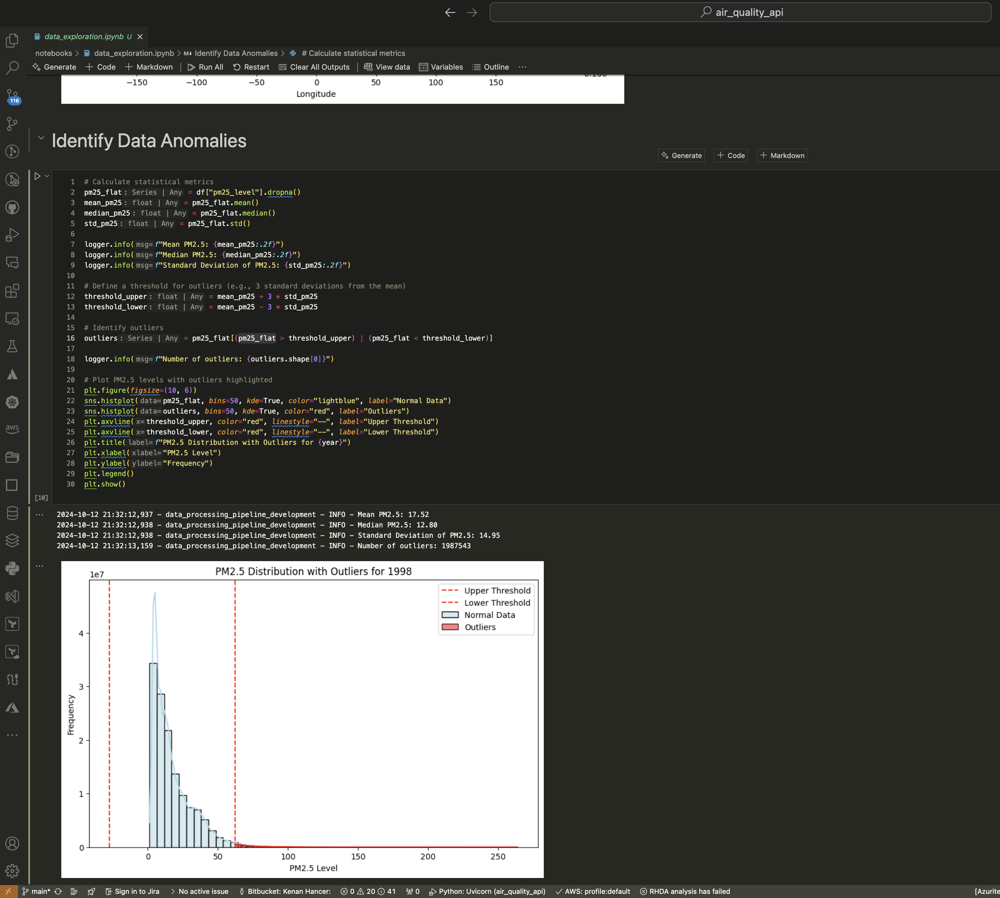
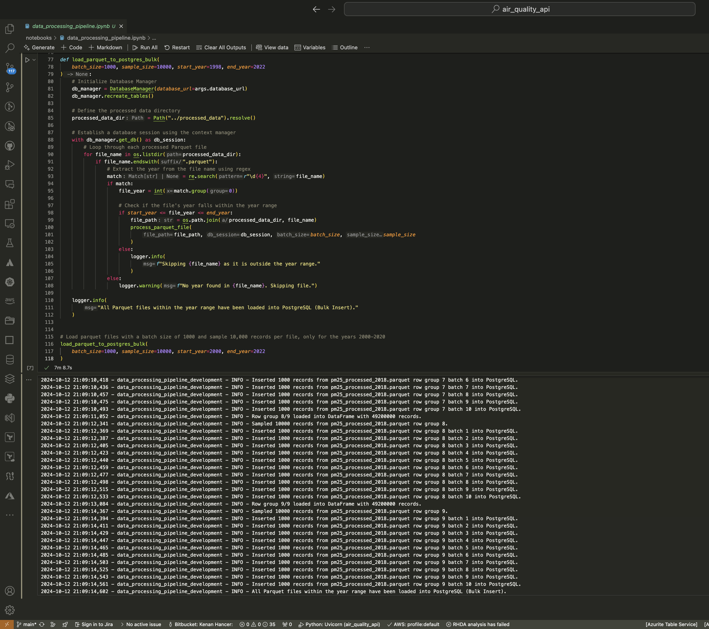

# air_quality_api

FastAPI RESTful API for transforming and analyzing SEDAC's Global Annual PM2.5 air quality data, featuring CRUD operations, filtering, statistics, normalization, and Docker containerization.



# Data Exploration Jupyter Notebook Images



# Bulk Insert of Parquet Data into PostgreSQL with Sampling
> It may take 10 mins or more.


## Test Postgres Connection from Host Machine Using `psql`

> Run the following command in terminal.

```
psql -h localhost -U air_quality_user -d air_quality_db -p 5433
```

Expected Output:

```
psql (13.16)
Type "help" for help.

air_quality_db=>
```

## Export Python Dependencies to `requirements.txt` Using `Poetry`

If you are using Poetry for dependency management and need to export the dependencies to a requirements.txt file for Docker, run:
```
poetry export -f requirements.txt --output requirements.txt --without-hashes
```

Then rebuild your Docker images:
```
docker compose up airqualityapi --build
```

## Build and Run from Host Machine

You can access the interactive API documentation provided by Swagger UI at http://localhost:8000/docs

```
poetry install
poetry shell
uvicorn app.main:app --reload
```

## Build and Run With Docker Compose

This command will:

- Build the Docker images for the API and the PostgreSQL database.
- Start the containers and run the API on http://localhost:8000
- You can access the interactive API documentation provided by Swagger UI at http://localhost:8000/docs

```
docker compose up --build
```

## Testing Endpoints

### Create a New Data Entry

```
curl -X POST "http://localhost:8000/data/" \
-H "Content-Type: application/json" \
-d '{
    "year": 2023,
    "latitude": 37.7749,
    "longitude": -122.4194,
    "pm25_level": 12.5
}'
```

### Retrieve All Data

```
curl -X GET "http://localhost:8000/data/"
```

### Retrieve a Specific Data Entry

```
curl -X GET "http://localhost:8000/data/1"
```

### Update an Existing Data Entry

```
curl -X PUT "http://localhost:8000/data/1" \
-H "Content-Type: application/json" \
-d '{
    "pm25_level": 15.0
}'
```

### Delete a Data Entry

```
curl -X DELETE "http://localhost:8000/data/1"
```

### Filter Data

```
curl -X GET "http://localhost:8000/data/filter?year=2023&lat=37.7749&long=-122.4194"
```

### Get Statistics

```
curl -X GET "http://localhost:8000/data/stats"
```

### Get Data Within a Region

```
curl -X GET "http://localhost:8000/data/region?lat_min=30&lat_max=40&long_min=-130&long_max=-120"
```

### Get Top 10 Polluted Locations for a Given Year

```
curl -X GET "http://localhost:8000/data/top10?year=2023"
```
